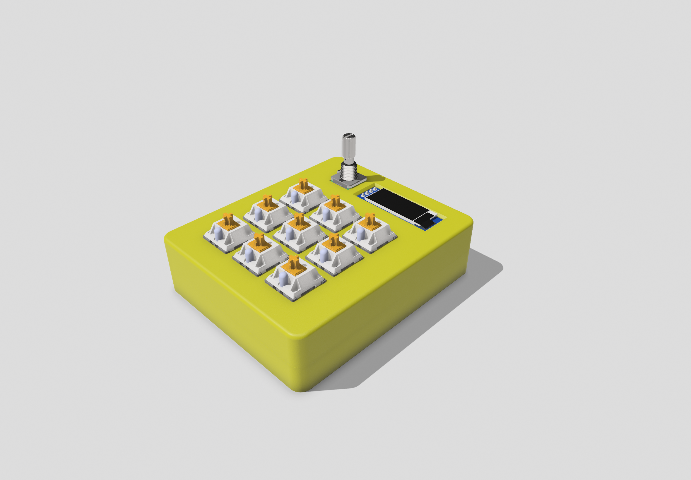
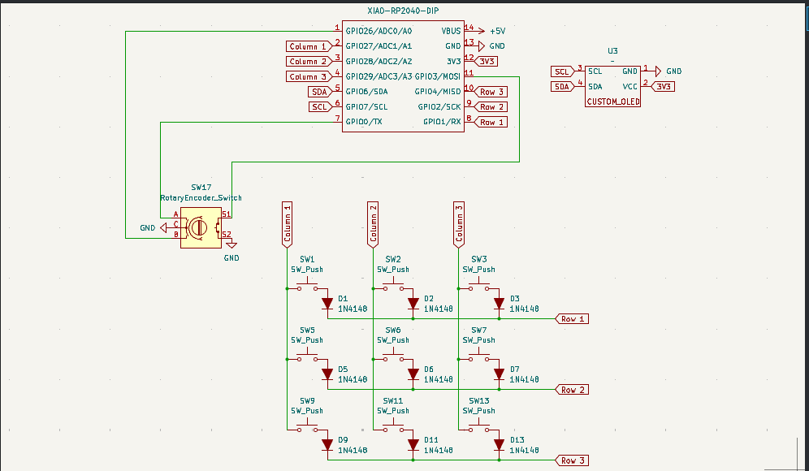
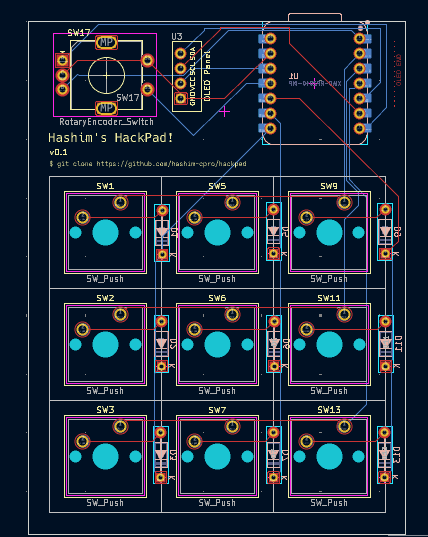

# Hackpad

A custom mechanical keypad/macropad built with RP2040 microcontroller featuring 6 Cherry MX switches, a rotary encoder and a OLED. My first ever Hardware project!

## Overview

## Schematic

## PCB

## Case

## Bill of Materials (BOM)

| Component              | Quantity |
| ---------------------- | -------- |
| Custom PCB             | 1x       |
| RP2040 Microcontroller | 1x       |
| Cherry MX Switches     | 6x       |
| EC11 Rotary Encoder    | 1x       |
| 0.91 icnh OLED         | 1x       |
| Front Case             | 1x       |
| Back Case              | 1x       |

## Firmware

Firmware is built using [QMK](https://qmk.fm/). It is pretty basic with only one Layer at the moment, but it is fully functional. I will add more features later.